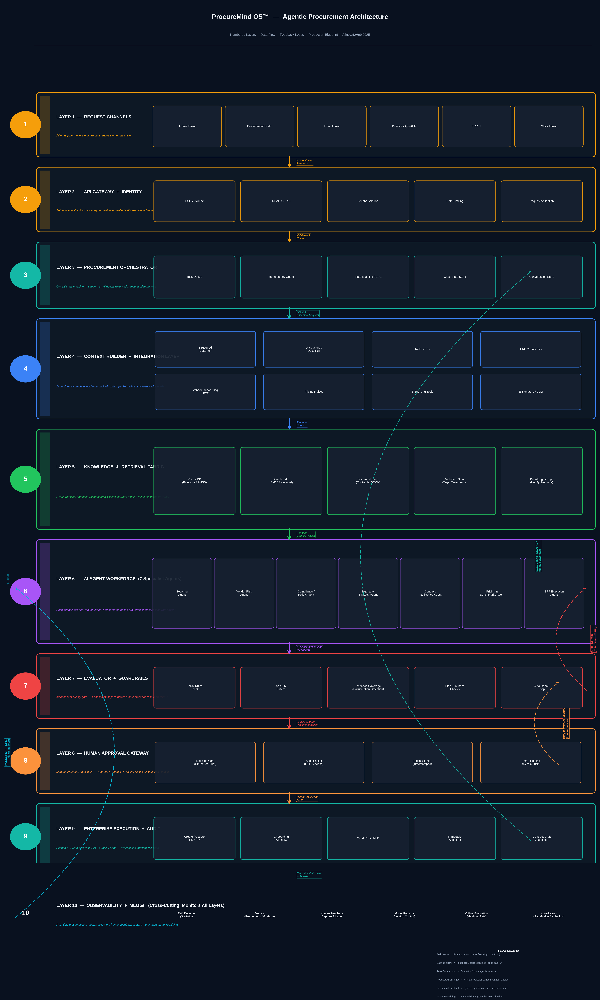

# 🧠 ProcureMind OS™ — Agentic Procurement Architecture (v2.0)  
**From Proof-of-Concept to Enterprise Production — Governed, Auditable, Execution-Safe**  
**Designed & Presented by [Ganesh Prasad Bhandari](https://www.linkedin.com/in/ganesh-prasad-bhandari-b165b9187/)**

---

## 🎓 Cite this Research & Authority
**Bhandari, G. P. (2025).**  
*ProcureMind OS™: Agentic Procurement Architecture — From Proof-of-Concept to Enterprise Production (v2.0).*  
📘 **Technical Whitepaper (Zenodo/CERN):** **[ADD DOI AFTER PUBLISH]**  
🚀 **Newsletter:** [Join AI Vanguard on LinkedIn](https://www.linkedin.com/newsletters/7220489256505331712/)  
🧬 **ORCID:** https://orcid.org/0009-0002-7308-4279  

---

## 📘 Overview
ProcureMind OS™ is an **enterprise architecture blueprint** for autonomous procurement intelligence. It combines:
- specialist AI agents (sourcing, risk, compliance, negotiation, contract intelligence)
- a **procurement knowledge graph** (vendors, geographies, clauses, policies, categories)
- **hybrid retrieval** (vector + keyword + graph traversal)
- an **Evaluator + Guardrails** quality gate
- a **Human Approval Gateway** for high-impact decisions
- **ERP execution + immutable audit trail**
- observability + continuous learning loops

The intent is to move intelligence **earlier** in procurement so that market signals, supplier risk, compliance constraints, and clause-level contract risk are surfaced **before** shortlists and approvals form. :contentReference[oaicite:2]{index=2}

---

## ⚙️ Problem Statement
Enterprise procurement decisions are multi-constraint under time pressure:
- market intelligence arrives after shortlists form  
- Supplier risk is discovered late (contract stage)  
- benchmarking depends on spreadsheets and memory  
- Clause interpretation requires context scattered across systems  

These are **architecture failures**, not process failures. ProcureMind OS fixes sequencing and governance so humans decide at the *right* point—after evidence is assembled and validated. :contentReference[oaicite:3]{index=3}

---

## 🏗️ System Architecture (10-Stage Production Lifecycle)

> **Figure:** Layered architecture with numbered stages and feedback loops.  
> **Governance Checkpoint:** Evaluator + Human Approval Gateway before enterprise execution. :contentReference[oaicite:4]{index=4}

---

## 🚀 Core Design: “Intelligence Earlier + Governance Before Execution”
ProcureMind OS is built around three non-negotiables:

### 1) Hybrid Retrieval (Ground every claim)
- **Vector search** for semantic discovery  
- **Keyword search** for exact clause/policy matches  
- **Graph traversal** for relational risk context (vendor → region → rule → clause)  
- **Self-RAG loop** checks evidence completeness before agents act :contentReference[oaicite:5]{index=5}

### 2) Specialist Agent Workforce (Scoped + tool-bounded)
Five primary agents run in a deterministic sequence:
- **Sourcing** → shortlist
- **Vendor Risk** → risk score + drivers
- **Compliance** → pass/flag with citations
- **Negotiation/Pricing** → target price + leverage
- **Contract Intelligence** → clause risk + redlines :contentReference[oaicite:6]{index=6}

### 3) Evaluator + Guardrails (Independent quality gate)
Evaluator runs:
- reasoning trace quality checks  
- hallucination detection (ground to retrieved sources)  
- supplier fairness checks  
- runtime guardrails (budget thresholds, data handling rules)  
If it fails → repair loop; if repair fails → block and escalate. :contentReference[oaicite:7]{index=7}

---

## 🧭 Scope & Validation Boundary (important)
ProcureMind OS is a **design blueprint/architecture synthesis** that combines established components (RAG, Self-RAG, multi-agent orchestration, evaluation layers, HITL governance, MLOps) into a coherent enterprise system.

**Performance targets** (e.g., sub-500ms agent decision cycles) are stated as **design assumptions**, not independent benchmarks, and must be validated per environment and integration profile. :contentReference[oaicite:8]{index=8}

---

## 📦 Repo Contents (recommended)

├── README.md
├── whitepaper/
│ └── ProcureMind_OS_WhitePaper_v2.pdf
└── assets/
└── ProcureMind_Architecture_Layered.png

---

## 🧾 References & Publication
- **Zenodo DOI:** **10.5281/zenodo.18912358**  
- **License:** **Creative Commons Attribution 4.0 International (CC BY 4.0)**.
  
### Copyright 
**© 2025 Ganesh Prasad Bhandari.**  
Licensed under **Creative Commons Attribution 4.0 International (CC BY 4.0)**.  
https://creativecommons.org/licenses/by/4.0/

---

## 🧭 Author & Global Ecosystem
**Ganesh Prasad Bhandari** — *AI Architect | Enterprise AI & GenAI Innovator*  

🌍 **Connect With Me:**  
[🔗 LinkedIn](https://www.linkedin.com/in/ganesh-prasad-bhandari-b165b9187/) |  
[▶️ YouTube](https://www.youtube.com/@AIINOVATEHUB) |  
[🧠 Medium](https://medium.com/@ganeshprasadbhandari79) |  
[💻 GitHub](https://github.com/GaneshPrasadBhandari) |  
[🧬 ORCID](https://orcid.org/0009-0002-7308-4279)

---

### Disclaimer
This is an architecture blueprint for educational and product-design purposes. It is not legal, compliance, or procurement advice.
